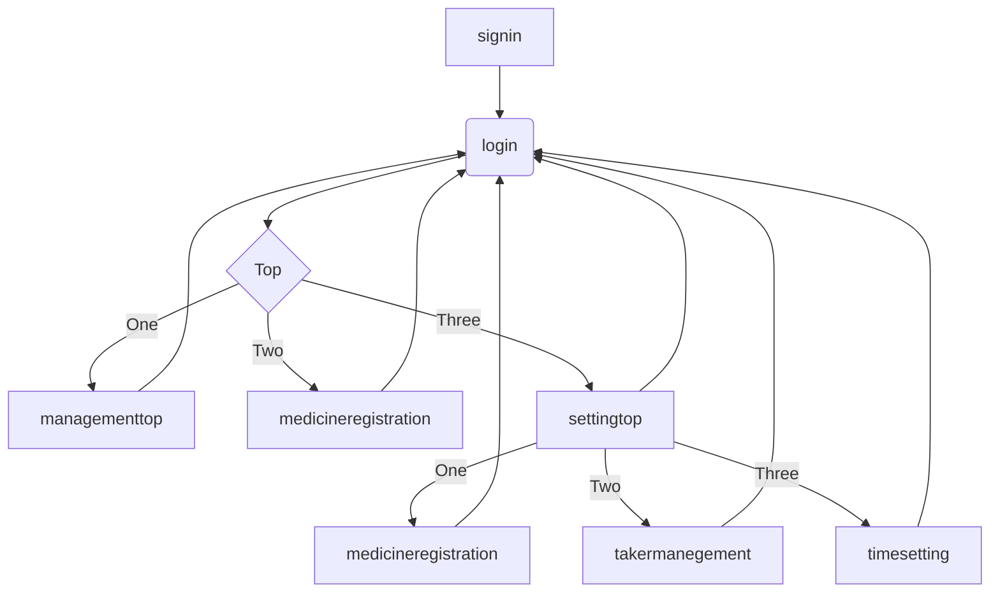

  

    

# 薬管理アプリのポートフォリオ  
# (Of the drug management portfolio)

## ポートフォリオについて(About the portfolio)  

このリポジトリは@yoshiayuのポートフォリオを公開するためのものです。  
画像、薬データ【約28,000件】及び製造メーカー【273社】が格納されています。  
本人だけではなく、家族二人分の服用薬を管理することができ、一人5種類の服用薬の登録及び  
プッシュ通知により　服用時間を通知できるアプリとなっています。  
しかしながら、まだまだ不完全な実装であり、更に改良する必要性があります。  
This repository is for publishing @ yoshiayu's portfolio.  
Images, drug data [about 28,000] and manufacturers [273 companies] are stored.  
It is possible to manage not only the person but also the medicines taken by two family members,  
and registration of 5 kinds of medicines per person and  
It is an application that can notify the dosing time by push notification.  
However, it is still an incomplete implementation and needs further improvement.  

# 実装にあたり使用した言語等  
# (Language etc. used for implementation)
* Python/Django
* HTML/CSS
* javascript
* スクレイピング(Scraping)
* webp(画像:image)
* SQLでのデータベース整理(Database organization with SQL)  

# 使用方法  

# 実装者  
## Ayumu Yoshinaga  
https://twitter.com/yoshiayu1  
https://www.instagram.com/ayumuyoshi

